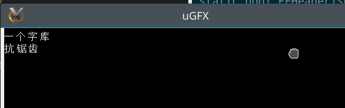

Microcontroller font library
============================

**WIP**

emmmm....

特性：
------
- 完整的中文字库支持(utf16,unicode plane 1)。
- 抗锯齿字库、点阵字库 生成、解码。
- 单文件多字库支持。

需求：
------
- 单片机完整文件系统支持。
- 有块屏幕。

进度：
------
- [x] encoder for 1-bit font.
- [x] encoder for anti-aliasing font.
- [x] combiner.
- [x] decoder header file.
- [ ] decoder source code (refactoring...)
- [ ] document & readme.
- [ ] demo.

截图：
-----

